# Hi, I'm Wellington Aquino 👋

**Full-stack Developer** · Back-end focused · Building scalable and clean solutions

---

---

### 🛠 Tech Stack

**Languages**

**Front-end**

**Back-end & Data**

**Cloud, DevOps & Automation**

---

